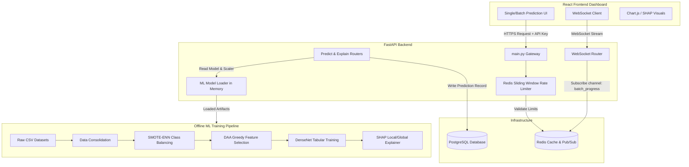

# Financial Risk Analysis Tool — End-to-End DenseNet Loan Default Prediction System

A production-grade, full-stack financial risk analysis application utilizing a **DenseNet** deep learning architecture for predicting loan defaults and financial distress on tabular datasets. The system features a greedy forward feature selection algorithm (DAA), **SMOTE-ENN** data balancing, and **SHAP (SHapley Additive exPlanations)** for local and global model explainability.

The application consists of three primary components:
1. **Machine Learning Pipeline**: A set of standalone Python scripts for feature engineering, data balancing, greedy feature selection, model training, evaluation, and SHAP serialization.
2. **FastAPI Backend API**: A high-performance async API with PostgreSQL database persistence (predictions, batch jobs history), sliding-window rate limiting, and Redis caching.
3. **React + Vite Frontend Dashboard**: An interactive, premium UI built with Framer Motion, Chart.js, and TailwindCSS, including real-time progress updates for batch prediction tasks via WebSockets.

---

## 🏗️ System Architecture & Technical Foundations



### 1. Tabular DenseNet Classifier
Adapted from the original image-classification architecture (Huang et al., 2017) to work with structured financial records, the tabular DenseNet:
* **Dense Connectivity**: Each bottleneck layer receives the concatenated features of *all* preceding layers in that Dense Block. This enhances gradient flow, mitigates vanishing gradients, and encourages feature reuse.
* **Bottleneck Layers**: Implemented as `BN` → `ReLU` → `Dense(4 * growth_rate)` → `BN` → `ReLU` → `Dense(growth_rate)` to reduce feature dimensionality prior to expensive projections.
* **Transition Layers**: Positioned between dense blocks, applying Batch Normalization, ReLU, and 50% feature compression (`compression = 0.5`) alongside Dropout (`dropout_rate = 0.3`) to prevent overfitting.
* **Heads**: Final classification head includes two dense layers (128 and 64 units) leading to a sigmoid output for binary classification (0: Healthy, 1: Distressed).

### 2. SMOTE-ENN Class Balancing
Loan default datasets are heavily imbalanced (e.g., standard defaults represent < 5% of entries). The system applies **SMOTE-ENN** (Synthetic Minority Over-sampling Technique + Edited Nearest Neighbors) to balance classes:
1. **SMOTE**: Synthesizes new minority instances along the line segments joining k-nearest neighbors (k=5).
2. **ENN**: Cleans noise and clears overlap between class clusters by removing any instance whose class differs from the majority class of its 3 nearest neighbors.

### 3. DAA Greedy Forward Feature Selection
A forward-selection search algorithm based on greedy paradigm principles:
* **Forced Phase**: Always picks the candidate that yields the highest cross-validated AUC-ROC score until `min_features` (default: 25) is reached.
* **Greedy Phase**: Continues to add features one-by-one as long as the marginal improvement in cross-validated AUC-ROC score is greater than the threshold $\epsilon$ (default: 0.001). Stops when no remaining feature yields an improvement $\ge \epsilon$.
* **Time Complexity**: $\mathcal{O}(k \cdot n \cdot \text{CV\_folds} \cdot \text{fit\_time})$ where $k$ is the selected features limit and $n$ is total features.

### 4. SHAP Explainability
* **Global Interpretability**: Generates summary beeswarm and feature importance plots detailing how each feature influences default predictions across the dataset.
* **Local Interpretability**: Dynamically calculates Shapley values for individual predictions and generates waterfall charts detailing which financial ratios pushed the score towards or away from the risk threshold.

---

## 📂 Project Structure

```
├── Financial Distress.csv               # Primary Financial Distress dataset (3672 × 83)
├── taiwanese_bankruptcy.csv             # Secondary Taiwanese Bankruptcy dataset (6819 × 95)
├── consolidated_dataset.csv             # Unified consolidated dataset (generated)
├── config.py                            # Centralized ML training configuration
├── data_preprocessing.py                # Data scaling, cleaning, train/test split
├── data_balancing.py                    # SMOTE-ENN balancing pipeline
├── data_consolidation.py                # Union consolidation of multiple datasets
├── greedy_feature_selection.py          # DAA forward feature selection algorithm
├── densenet_model.py                    # DenseNet architecture and training loop
├── evaluation.py                        # Classification reports, ROC curves, confusion matrix
├── shap_explainer.py                    # SHAP explainer creation & serialization
├── train.py                             # Main ML training orchestrator
├── prediction.py                        # Standalone prediction script (single/batch)
├── requirements.txt                     # Standalone ML pip requirements
├── docker-compose.yml                   # Postgres database & Redis dev infrastructure
│
├── backend/                             # FASTAPI BACKEND APPLICATION
│   ├── requirements.txt                 # Backend-specific dependencies
│   └── app/
│       ├── __init__.py
│       ├── config.py                    # FastAPI environment & path configuration
│       ├── database.py                  # SQLAlchemy engine & async session setup
│       ├── dependencies.py              # API key verification & Redis rate-limiting
│       ├── main.py                      # FastAPI entrypoint, lifespan, CORS, mounts
│       ├── models.py                    # SQLAlchemy ORM models (Predictions, BatchJobs)
│       ├── schemas.py                   # Pydantic schemas for request validation
│       ├── ml/                          # Loaded Model Explainer & Predictor Wrapper
│       │   ├── __init__.py
│       │   ├── explainer.py             # Computes live SHAP explanations for the API
│       │   ├── model_loader.py          # Handles thread-safe loading of DenseNet & Scaler
│       │   └── predictor.py             # Predicts single & batch instances in memory
│       ├── routers/
│       │   ├── __init__.py
│       │   ├── predict.py               # HTTP endpoints for single & batch prediction
│       │   ├── explain.py               # HTTP endpoint for SHAP explanations
│       │   ├── model_info.py            # API metadata (metrics, loaded features, features list)
│       │   ├── history.py               # Historical records retrieval
│       │   └── websocket.py             # Real-time WebSocket stream for batch progress
│       └── tasks/
│           ├── __init__.py
│           └── batch_processor.py       # Async Background Task for processing batch uploads
│
└── frontend/                            # REACT + VITE FRONTEND DASHBOARD
    ├── package.json                     # Frontend dependencies & scripts
    ├── index.html
    ├── src/
    │   ├── main.jsx
    │   ├── App.jsx                      # App component, routing layout
    │   ├── index.css                    # Global styling and scroll animations
    │   ├── api/                         # Client Axios configuration and requests
    │   ├── components/                  # Common elements (nav, loader, modals)
    │   ├── pages/                       # Dashboard views
    │   │   ├── DashboardPage.jsx        # Model health, database metrics & summary cards
    │   │   ├── PredictPage.jsx          # Single applicant manual-input risk analysis
    │   │   ├── BatchPage.jsx            # CSV upload drag-and-drop & WebSocket progress
    │   │   ├── InsightsPage.jsx         # Global SHAP beeswarm & validation metrics
    │   │   └── HistoryPage.jsx          # Audit trail of past default predictions
    │   └── utils/
    └── public/
```

---

## 🛠️ Installation & Setup

### 1. Set Up Infrastructure (Docker Compose)
Start the PostgreSQL and Redis containers in the background:
```bash
docker-compose up -d
```
* **PostgreSQL** runs on port `5432` with database `financial_risk`.
* **Redis** runs on port `6379`.

### 2. Standalone Machine Learning Setup & Training
To train the model or run feature selection locally:
```bash
# Create and activate virtual environment at project root
python3 -m venv .venv
source .venv/bin/activate

# Install dependencies
pip install --upgrade pip
pip install -r requirements.txt
```

#### Run Data Consolidation & Greedy Feature Selection
1. **Consolidate datasets**: Merges `Financial Distress.csv` and `taiwanese_bankruptcy.csv` to create `consolidated_dataset.csv`.
2. **Feature selection**: Evaluates the features using Stratified 5-Fold Cross Validation.
```bash
python greedy_feature_selection.py
```
This writes the final feature set to `outputs/reports/selected_features.json` and exports progress plots.

#### Train the DenseNet Model
Execute the full training orchestrator:
```bash
# Train on the consolidated dataset with greedy features & SHAP
python train.py --consolidated --use-selected-features

# Train without generating SHAP plots (faster, for verification)
python train.py --consolidated --use-selected-features --skip-shap
```
Trained weights will be exported to `outputs/model/densenet_model.h5`, the fitted scaler to `outputs/model/scaler.joblib`, and metrics report to `outputs/reports/metrics.json`.

---

### 3. FastAPI Backend Setup
With the model trained and outputs generated:
```bash
# Open backend directory
cd backend

# Install backend dependencies
pip install -r requirements.txt

# Run the FastAPI server in hot-reload development mode
python -m uvicorn app.main:app --host 127.0.0.1 --port 8000 --reload
```
* The API will be available at `http://127.0.0.1:8000`
* Interactive OpenAPI Swagger UI docs are auto-generated at `http://127.0.0.1:8000/docs`

---

### 4. React Frontend Setup
```bash
# Open frontend directory
cd frontend

# Install Node modules
npm install

# Run Vite dev server
npm run dev
```
* The React Application will launch at `http://localhost:5173`

---

## 📡 API Endpoints

All prediction and explanation endpoints require the `X-API-Key: fra-dev-key-2024` header and are rate-limited to 100 requests per minute.

### 1. Single Prediction
* **Endpoint**: `POST /api/v1/predict/single`
* **Request Body**: JSON mapping selected features to float values.
* **Response**:
  ```json
  {
    "id": "e2ba904c-35cd-4581-9b87-43cf18a221f7",
    "prediction": 1,
    "probability": 0.842,
    "decision": "HIGH RISK / DEFAULT",
    "confidence": 84.2,
    "created_at": "2026-06-05T13:50:22.128Z"
  }
  ```

### 2. SHAP Explanation
* **Endpoint**: `POST /api/v1/explain`
* **Request Body**: Feature mapping JSON (same as single prediction).
* **Response**:
  ```json
  {
    "prediction_id": "e2ba904c-35cd-4581-9b87-43cf18a221f7",
    "base_value": 0.321,
    "prediction_value": 0.842,
    "explanations": [
      { "feature": "fd_x2", "shap_value": 0.21, "feature_value": -1.45 },
      { "feature": "tw_f12", "shap_value": 0.15, "feature_value": 0.82 }
    ]
  }
  ```

### 3. Batch Predictions
* **Endpoint**: `POST /api/v1/predict/batch`
* **Request**: Multipart Form Data containing `file: your_dataset.csv`.
* **Response**:
  ```json
  {
    "task_id": "753eb492-c07a-4299-87a4-e910efc68192",
    "filename": "applicants_June.csv",
    "total_rows": 150,
    "status": "PENDING"
  }
  ```

### 4. WebSocket Batch Progress Stream
* **URL**: `WS /ws/batch/{task_id}`
* **Stream Events**:
  ```json
  {"status": "PROCESSING", "processed": 30, "total": 150}
  {"status": "PROCESSING", "processed": 90, "total": 150}
  {"status": "COMPLETED", "processed": 150, "total": 150}
  ```

---

## 📊 Application Interface

1. **Dashboard Page**: Displays backend connectivity, database record count, and loaded neural network dimensions. Shows metric gauges for Accuracy, AUC, and MCC.
2. **Predict Page**: Renders dynamic slider and numerical inputs for the selected feature subset. Displays immediate prediction outcomes, a gauge chart of default probability, and a local SHAP waterfall graph showing the contribution of each ratio.
3. **Batch Predict Page**: Features a drag-and-drop CSV uploader. Initiates processing, displays a dynamic progress bar fueled by WebSockets, and enables downloading of predictions appended directly to the input CSV.
4. **Insights Page**: Houses training analytics, confusion matrices, validation curve graphics, and global SHAP beeswarm graphs indicating overall model feature importance.
5. **History Page**: A searchable audit trail of past predictions. Allows administrators to review inputs, outputs, and recalculate local explanations on the fly.

---

## 🔧 Troubleshooting

| Problem | Cause | Solution |
| :--- | :--- | :--- |
| **Backend connection refused (`500` or `ErrConn`)** | PostgreSQL or Redis not running. | Run `docker-compose up -d` and check status with `docker ps`. |
| **Model loading error at API startup** | Missing model files. | Run `python train.py` from root directory to generate `.h5` files. |
| **Rate Limit Exceeded (`429`)** | Request frequency exceeds 100 req/min. | Reduce frequency or customize `RATE_LIMIT_PER_MINUTE` in `backend/.env`. |
| **SMOTE-ENN fails** | Dataset has insufficient minority samples. | Ensure target column is binary and contains at least 6 positive instances. |
| **WebSocket fails immediately** | Redis cache unavailable. | The WS router depends on Redis Pub/Sub. Verify Redis port `6379` is open and responsive. |
